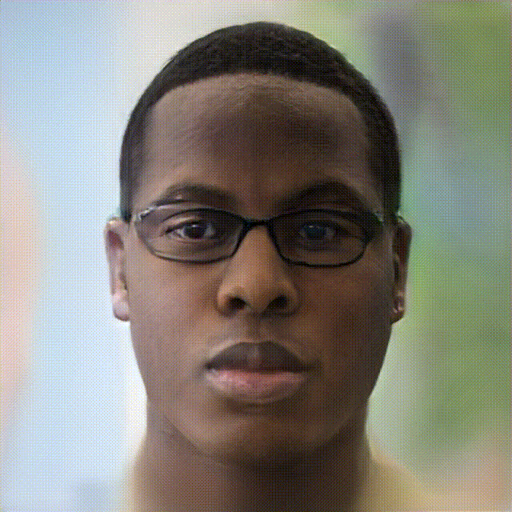

## PSO-HEAD: Pseudo-Supervision Guided Spatial Optimization for View-consistent 3D Full-Head Reconstruction<br>





**PSO-HEAD: Pseudo-Supervision Guided Spatial Optimization for View-consistent 3D Full-Head Reconstruction**<br>
Yiheng Zhang, Peng ZHang, XiaoLin Zhang

Abstract: *Generative 3D human head reconstruction in $360^{\circ}$ is attracting increasing attention because of its flexibility in downstream animation applications. Existing generative 3D head synthesis approaches are primarily limited to near-frontal face priors, which cause distorted artifacts at large view angles. In this paper, we introduce a novel Pseudo-Supervision guided Spatial Optimization (PSO-HEAD) framework that reconstructs 3D view-consistent full-head through explicitly introducing pseudo-label of back-head supervision for spatial texture and geometric optimization. Particularly, our PSO-HEAD introduces two key improvements, \ie, Pseudo-Supervision Augmented Inversion (PSA-Inversion) and Full-head Aware Generative Enhancement (FAGE). PSA-Inversion augments plausible invisible back-head as pseudo supervision to optimize the view-hallucinated latent code conditioned on the augmented camera poses via GAN inversion, enforcing 3D spatial consistency across both visible and invisible regions. Furthermore, FAGE fine-tunes the 3D GAN on a proposed auxiliary FK-Enhance dataset deriving from either generated or real-world high-quality back-head images, which therefore improves the generalization of our PSO-HEAD to diverse hairstyles or underrepresented regions. Benefiting from the improvements, our PSO-HEAD enables efficient $360^{\circ}$ view-consistent full-head generation from single input images, particularly improving reconstruction fidelity of unobserved regions, which quantitatively and qualitatively outperforms the state-of-the-art methods.*

## Requirements
```
cd pso-head
conda env create -f environment.yml
conda activate pso-head
```
## Obtaining camera pose and cropping the images

Please follow the [guide](Pose Estimator/cropping_guide.md)
### Steps


#### 1. cd to 3DDFA_V2. 
```.bash
cd 3DDFA_V2
```

#### 2. Extract face keypoints using dlib. 
```.bash
python dlib_kps.py 
```

#### 3. Obtaining camera poses and cropping the images using recrop_images.py

```.bash
python recrop_images.py -i data.pkl -j dataset.json
```

## Generate full head reconstruction from a single RGB image
```
.bash
# Please refer to ./gen_pti_script.sh
```


## Datasets
Due to the license issue, we are not able to release [Flickr-Faces-HQ dataset](https://github.com/NVlabs/ffhq-dataset) and [K-Hairstyle dataset](https://psh01087.github.io/K-Hairstyle/) that we used to train the model. [test_data_img](./dataset/testdata_img/) and [test_data_seg](./dataset/testdata_seg/) are just an example for showing the dataset struture. For the camera pose convention, please refer to [PanoHead](https://sizhean.github.io/panohead). 


## Datasets format
For training purpose, we can use either zip files or normal folder for image dataset and segmentation dataset. For PTI, we need to use folder.
To compress dataset folder to zip file, we can use [dataset_tool_seg](./dataset_tool_seg.py). 

## Obtaining segmentation masks
You can try using deeplabv3 or other off-the-shelf tool to generate the masks.

## Using networks from Python

You can use pre-trained networks in your own Python code as follows:

```.python
with open('*.pkl', 'rb') as f:
    G = pickle.load(f)['G_ema'].cuda()  # torch.nn.Module
z = torch.randn([1, G.z_dim]).cuda()    # latent codes
c = torch.cat([cam2world_pose.reshape(-1, 16), intrinsics.reshape(-1, 9)], 1) # camera parameters
img = G(z, c)['image']                           # NCHW, float32, dynamic range [-1, +1], no truncation
mask = G(z, c)['image_mask']                    # NHW, int8, [0,255]
```

The above code requires `torch_utils` and `dnnlib` to be accessible via `PYTHONPATH`. It does not need source code for the networks themselves &mdash; their class definitions are loaded from the pickle via `torch_utils.persistence`.


## Acknowledgements

We thank Shuhong Chen for the discussion during Sizhe's internship.

This repo is heavily based off the [PanoHead](https://sizhean.github.io/panohead) repo; Huge thanks to the EG3D authors for releasing their code!